# Quantum Music Playground
## Summary

Playground for composing music using quantum states. Implemented as a Max for Live device in Ableton Live 11. Apache 2.0 licensed. Developed by James L. Weaver.

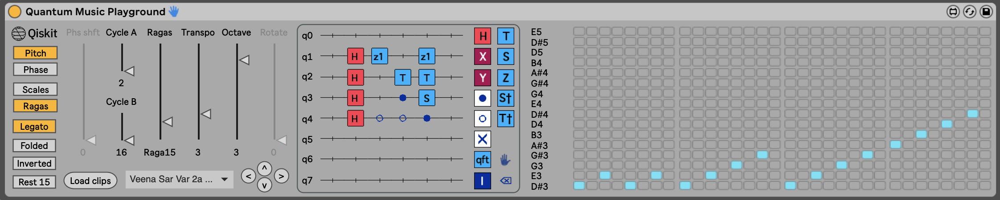

> Please note that it is ***not*** necessary to have prior knowledge of quantum computing in order to use Quantum Music Playground. We'll sneak in what you need to know as we go along, and will reference helpful (but not essential to internalize) resources.

## Introduction

The Quantum Music Playground is a tool for composing music, as well as an enjoyable way of gaining intuition about quantum circuits and states. It is implemented as a Max for Live device in the Ableton Live 11 digital audio workstation (DAW). The following screenshot shows an Ableton Live Session View that contains [MIDI](https://en.wikipedia.org/wiki/MIDI) clips that play an arrangement of the well known song entitled *Twinkle Twinkle Little Star*.

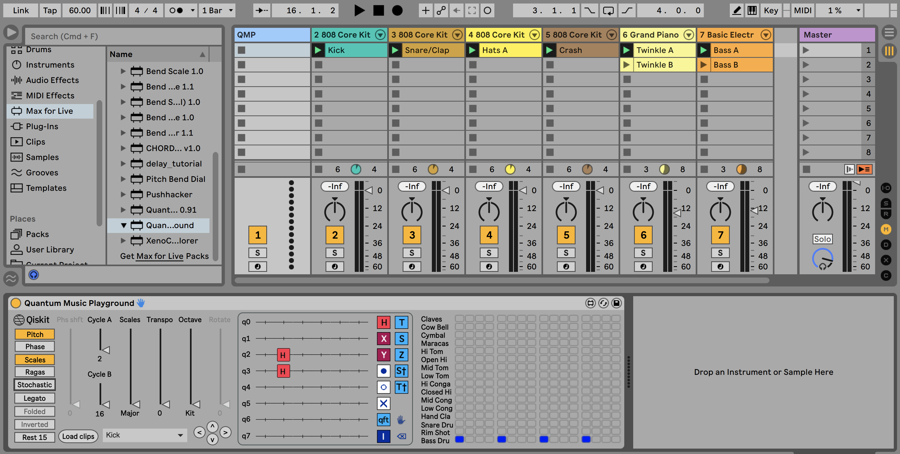

At the bottom of the screenshot is the Quantum Music Playground device, shown here expressing the kick drum part contained in the **Kick** clip in one of the tracks labeled **808 Core Kit**. In the center of the device is a [quantum circuit](https://qiskit.org/documentation/qc_intro.html#quantum-circuits), shown by itself in the following image.

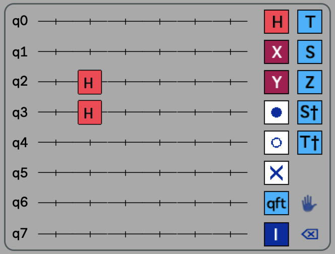

On the right side of the quantum circuit is a toolbox with quantum operations that may be placed on the quantum circuit, which is on the left side of the image. For the kick drum part, we're using a couple of **H** gates on the wires labeled **q2** and **q3**. The result is that the **Bass Drum** will play a [four on the floor](https://en.wikipedia.org/wiki/Four_on_the_floor_(music)) drum pattern shown in the sequence grid below. This sequence grid represents one measure in [4/4 time](https://en.wikipedia.org/wiki/Time_signature#Characteristics), and each column represents a [sixteenth note](https://en.wikipedia.org/wiki/Sixteenth_note). As you can see, the bass drum is playing on each of the four beats in the measure.

***TODO: Remove radians from the image, and introduce in a future image***

The logic by which a couple of H gates (also known as Hadamard gates) resulted in this drum pattern can be explained using some basic math:

First off, the wires labeled **q0** - **q7** on the quantum circuit represent the least significant digit through the most significant digit of a binary value. The reason that there are 16 columns in the previous grid is that **q3** (the fourth wire) is the highest wire on which a gate is present. This defines a range of 24 binary numbers from `0000` - `1111`, and are labeled **Basis states** across the bottom of the previous image. Each *basis state* represents a step in our musical sequence. 

> **A bit about basis states**
>
> A basis state, sometime referred to as a *computational basis state*, is a concept used in quantum computing to represent a component of a quantum state. In this example, the quantum circuit defines a quantum state that is comprised of 16 basis states. Each basis state contains a complex number from which two important values can be derived: The *probability* that this basis state will be the result when measuring the quantum state, and the *phase angle* of this basis state. Both of these concepts will be covered at appropriate times in this tutorial. For now, it is important to understand that there is one binary digit in each basis state for each wire in a quantum circuit, where the number of wires is determined by the highest wire on which a gate is present. It is also necessary to know that the rightmost binary digit of each basis state corresponds to the topmost wire, labeled **q0**. As you may know, the rightmost binary digit is referred to as being in position 0, because its place value is 20 in the binary numbering system.

To calculate on which of these sequence steps the bass drum will play, take a look at the quantum circuit and the sequence grid together in this image while reading the explanation that follows.

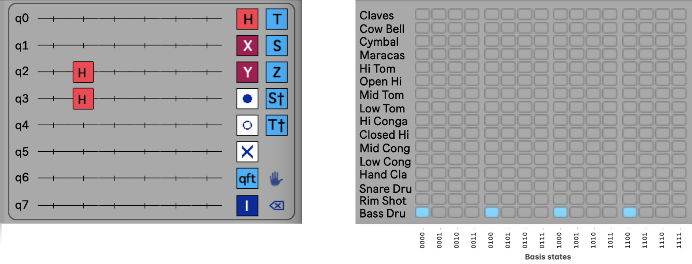

Each of the wires in the quantum circuit contains an initial value of 0.

- Because there are no gates on wire **q0**, the drum may only play on basis states whose 0 (least significant) position contains 0.
- Because there are no gates on wire **q1**, the drum may only play on basis states whose 1 position contains 0.
- Because there is an **H** gate on wire **q2**, the drum may play on basis states whose 2 position contains either 0 or 1. This is because the H gate puts the wire into a combination of 0 and 1.
- Because there is an **H** gate on wire **q3**, the drum may play on basis states whose 3 position contains either 0 or 1.

Putting that all together, the bass drum will play on all of the basis states whose 0 and 1 positions contain 0, which are `0000`, `0100`, `1000` and `1100`. 

> **Try it out:**
>
> Experiment with simple bass drum beat patterns by removing and placing **H** gates on the quantum circuit. To remove a gate, press the ⌫ tool (bottom right of toolboxl) and press a gate to delete. To add an **H** gate, press the **H** gate (upper left in toolbox) and press a location on the quantum circuit.

You may be wondering why the bass drum, and not the other instruments, are played as a result of this quantum circuit. The short answer is that the Quantum Music Playground chooses instruments and pitches based upon the phase angles mentioned earlier. The next section contains a more complete and satisfying explanation.

## Choosing instruments and pitches

Up to this point we've created a simple bass drum beat pattern by placing Hadamard gates on a quantum circuit. Now we're going to choose a different instrument to provide a cymbal crash at the beginning of each measure. As before, at the bottom of the following screenshot is the Quantum Music Playground device, now expressing the cymbal part contained in the **Crash** clip in another one of the tracks labeled **808 Core Kit**. 

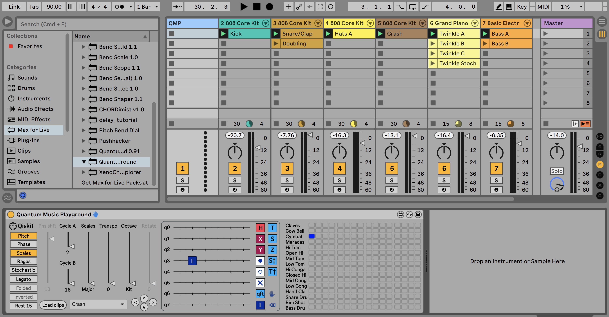

Let's examine the Quantum Music Playground device by itself in the following image.

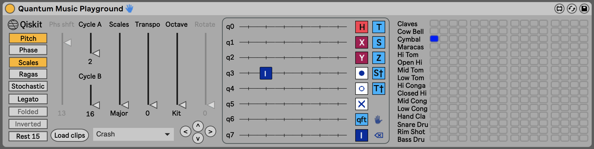

The quantum circuit in this **Crash** clip contains just one gate, namely the **I** (also known as identity) gate. The **I** gate doesn't alter the state of a wire, but it's used here to set the number of basis states, and therefore steps, to 16 for this clip. The length of this **Crash** clip is now the same length as the **Kick** clip, so as each clip is playing in a loop, the cymbal and the bass drum will play together on the downbeat of the measure, followed by the bass drum playing on the remaining three beats. 

To see why the Cymbal, rather than the Bass Drum, will be played, take a look at the disabled **Phs shft** slider and notice the value of 13 at the bottom. This indicates that the global phase angle shift, often referred to as *global phase shift*, of the quantum state is 13π/8 radians (292.5 degrees). This happens to correspond with the value of 13 to the right of the **Cymbal** row in the following image.

As mentioned previously, each individual basis state contains a phase angle. Shifting the global phase by π/8 radians (22.5 degrees) shifts each individual phase by π/8 radians, which results in moving the notes up one instrument or pitch.

> **Try it out:**
>
> Experiment with shifting the global phase angle by selecting the **Phase** button, moving the **Phs shft** slider up or down, and then selecting the **Pitch** button to keep the global phase from automatically shifting.

### Shifting the phase angles of basis states

To create an interesting beat pattern or melody, it is usually necessary to shift the phase angles of various basis states. A common way to accomplish this is to follow an **H** gate with a *phase* gate. To demonstrate this, we'll play hi-hat cymbals, shifting back and forth from open to closed hi-hats. The bottom of the following screenshot shows the Quantum Music Playground device, now expressing the hi-hat part contained in the **Hats A** clip in yet another one of the tracks labeled **808 Core Kit**.  

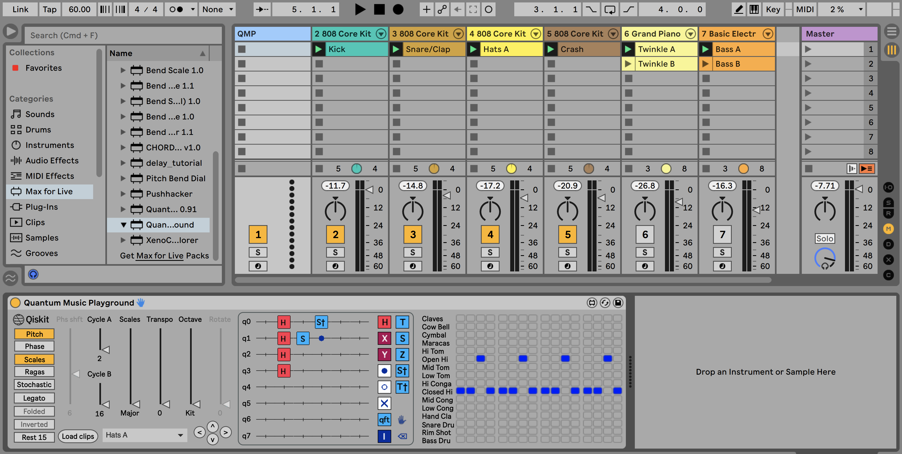

Now we'll examine the Quantum Music Playground device by itself in the following image.

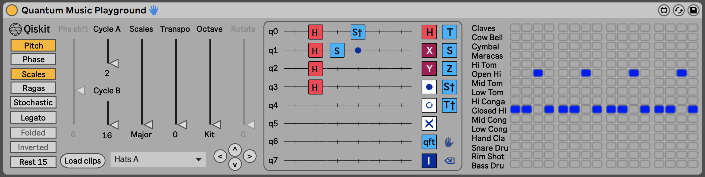

The quantum circuit in this **Hats A** clip contains a column of four H gates on wires **q0** - **q3**, which defines one measure with a beat pattern full of sixteenth notes. The circuit also contains two of the *phase gates* obtained from right column of the toolbox, and a *control gate modifier* taken from the toolbox's left column. We'll discuss phase gates and control gate modifiers shortly, but let's analyze the results of progressively adding gates to this circuit. The following image shows the Quantum Music Playground device after placing only the **H** gates.

 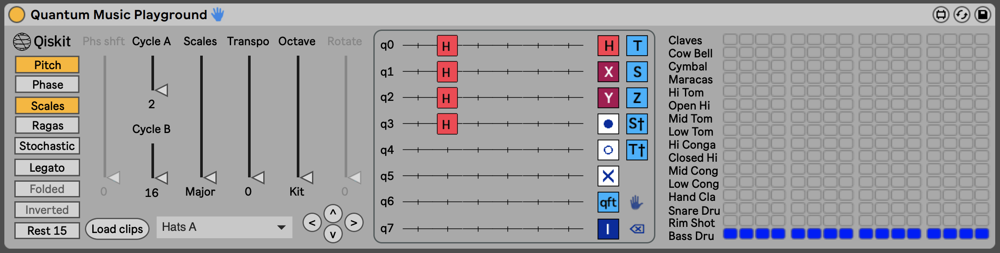

As with the **Kick** clip earlier, the **H** gates play a beat pattern on the Bass Drum. Next, the following image shows the **Phase** button selected and the **Phs shft** slider adjusted so that the **Closed Hi-hat** is played with the same beat pattern, having been shifted by a global phase. 

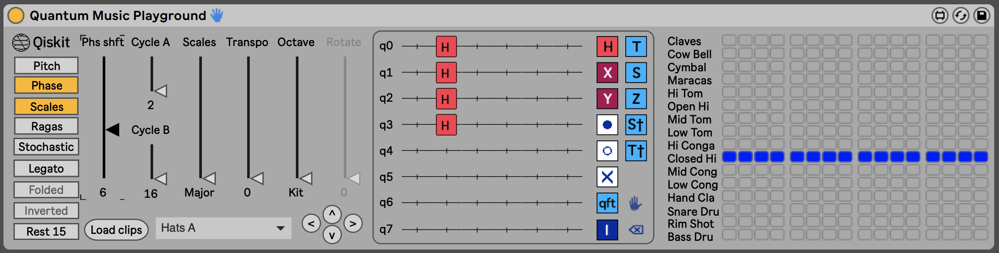

To play the **Open Hi-hat** on the third sixteenth note of every beat, we employ one of the *phase gates*, specifically the **S** gate. 

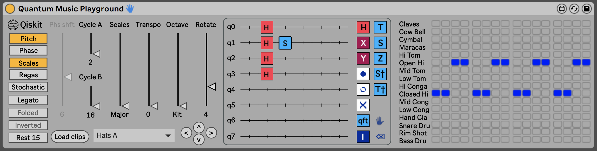

The **S** gate rotates the phase on a wire by 4π/8 radians, which rotates the phase on each of the basis states whose corresponding position contains a 1. This is seen more clearly in the following image, in which the rotation is performed on every basis state whose bit in position 1 is 1

Finally, to play the **Open Hi-hat** on the fourth sixteenth note of every beat, we employ another one of the *phase gates*, specifically the **S†** gate, in conjunction with the control gate modifier. 

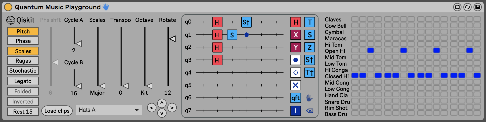

The **S†** gate rotates the phase on a wire by 12π/8 radians. However, when a control gate modifier is placed in the same column, the **S†** gate only operates when the control wire has a value of 1. This rotates the phase on each of the basis states whose positions corresponding to the **S†** gate and the control gate modifier both contain a 1. This is seen more clearly in the following image, in which the rotation is performed on every basis state whose bits in positions 0 and 1 are both 1.

> **Try it out:**
>
> Create different beat patterns that consist of closed and open hi-hats

### Leveraging the Quantum Fourier Transform

TODO: Write this section

## Playing with rhythm

So far, the rhythms we've created have consisted of instruments playing at consistent time intervals. For example, our **Kick** clip played the bass drum on the four beats of the measure, and the **Hats A** clip played the hi-hats on each sixteenth note. Now we'll discuss how to create syncopated rhythms, beginning with playing on the [off-beats](https://en.wikipedia.org/wiki/Beat_(music)#On-beat_and_off-beat) . To demonstrate this, we'll play a snare drum on beat two of a measure, and a hand clap on beat four of the measure, but nothing will be played on beats one and three. The bottom of the following screenshot shows the Quantum Music Playground device, now expressing the **Snare Drum** and **Hand Clap** parts contained in the **Snare/Clap** clip in another one of the tracks labeled **808 Core Kit**.

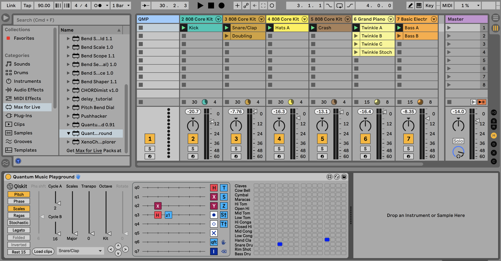

Looking at the following image of the Quantum Music Playground, we see that there are some similarities to the previous example in which open and closed hi-hats were played, but there are some differences to point out as well. 

One difference is that the phase gate on the quantum circuit is labeled **z1**, but there is no **z1** gate in the toolbox. This is because out of the 16 possible gates that rotate multiples of π/8 radians, only five of them (**T**, **S**, **Z**, **S†** and **T†**) have names. The rest are expressed in Quantum Music Playground with a lower case **z** and the number of π/8 radians by which they rotate the phase. Here is a table of phase gates and their rotations expressed in π/8 radians.

| Phase gate:      | z0   | z1   | T    | z3   | S    | z5   | z6   | z7   | Z    | z9   | z10  | z11  | S†   | z13  | T†   | z15  |
| ---------------- | ---- | ---- | ---- | ---- | ---- | ---- | ---- | ---- | ---- | ---- | ---- | ---- | ---- | ---- | ---- | ---- |
| **π/8 radians**: | 0    | 1    | 2    | 3    | 4    | 5    | 6    | 7    | 8    | 9    | 10   | 11   | 12   | 13   | 14   | 15   |

When a gate is placed, or selected on the quantum circuit with the ✋ tool (near the bottom right in the toolbox), it may be rotated by adjusting the Rotate slider, or clicking and dragging the gate vertically.

Another difference from the previous example is that an **X** gate, also known as a *NOT* gate or a *bit-flip* gate, is leveraged on wire **q2** to make the instruments play on the off beats. This is seen more clearly in the following image, in which the notes appear on some basis states whose bit in positions 2 is 1, because the **X** gate flipped that wire to having a value of 1.

Now that we've used the X gate to play on the off beat, let's use it to syncopate a simple bass line.

### Leveraging the CNOT gate for more syncopation

Let's discuss how to create more syncopated rhythms, leveraging the [CNOT gate](https://quantum-computing.ibm.com/composer/docs/operations-glossary/operations-glossary#cnot-gate) . This gate is also known as the *controlled-NOT* gate, as well as the *controlled-X gate*. To demonstrate this technique, we'll play a simple bass line in a syncopated fashion. The bottom of the following screenshot shows the Quantum Music Playground device, now expressing the note pitches to be played by the bass guitar in the **Bass B** clip of the track labeled **Basic Electr**.

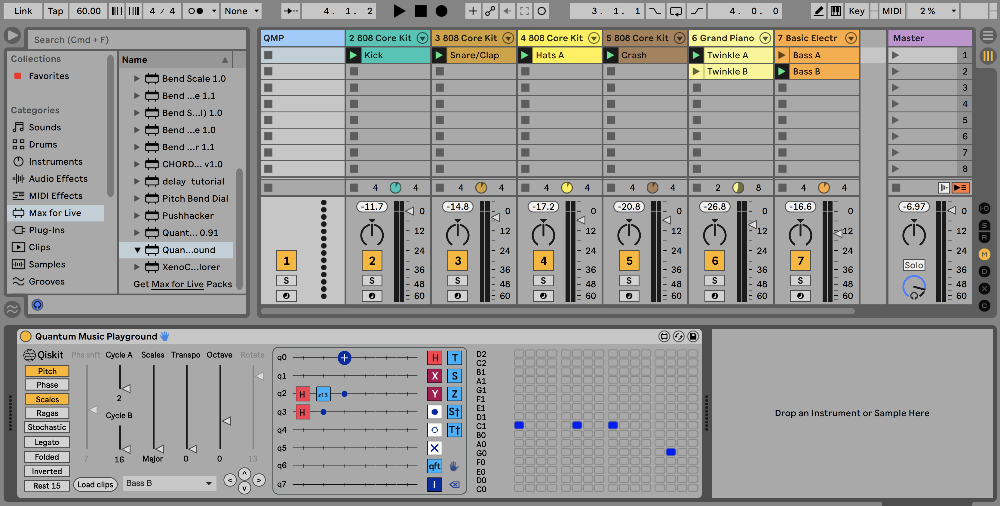

Looking at the following image of the Quantum Music Playground, you'll notice that we're playing note pitches rather than percussion instruments. The main point of this example, however, is the use of the control gate modifier with the **X** gate, turning it into a *CNOT* gate. Notice that the **X** turns into a plus sign inside of a filled circle, and that the bit is flipped only when the control wire has a value of 1. This flips the bit in the position on which the **X** gate is placed, but only on the basis states whose position corresponding to the control gate modifier contain a 1.

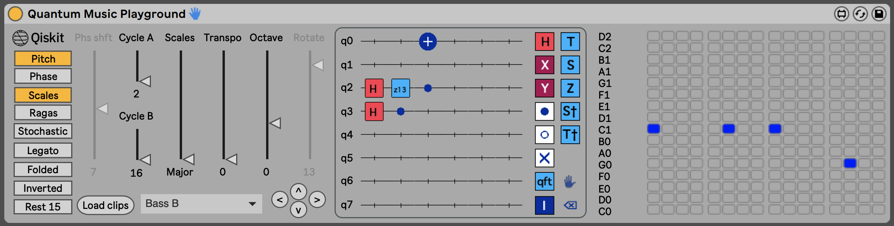

This is seen more clearly in the following image, in which the notes appear on some basis states whose bit in position 0 is 1, because the **X** gate conditionally flipped that wire to having a value of 1.

Now that we've discussed how to syncopate rhythms with X and CNOT gates, we'll introduce another way to manipulate rhythms.

### Manipulating rhythms with controlled H gates

We've leveraged **H** gates quite a bit to create rhythm patterns so far. Now we'll add control gate modifiers to **H** gates for more rhythmic control. In the following image of the **Doubling** clip in Quantum Music Playground, notice the use of control gate modifiers with some of the **H** gates to implement a well-known drum pattern in electronic dance music. This doubling pattern is achieved in part by making the **H** gate on wire **q0** conditional on whether the final eight out of 32 steps in the pattern are being played. Note that we're using two control gate modifiers in that column, in this case making the **H** gate active only when the 32 basis states (numbered `00000` through `11111`) begin with `11`.

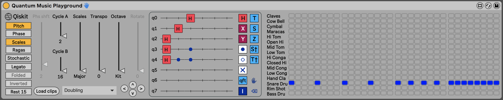

Now that we've discussed multiple ways of creating patterns, we'll introduce ways to drop notes out of a pattern so that they don't play.

### Dropping notes out of a pattern

Creating a rhythm is as much about the notes that are not played as the notes that are. Therefore, an important part of rhythm is inserting rests. There are several techniques for doing so with Quantum Music Playground, with the first method being turning down the amplitude of their basis states. To demonstrate this, we'll play the "up above the world so high, like a diamond in the sky" phrase of the melody in *Twinkle Twinkle Little Star*. The bottom of the following screenshot shows the Quantum Music Playground device, now expressing the note pitches to be played by the piano in the **Twinkle B** clip of the track labeled **Grand Piano**.

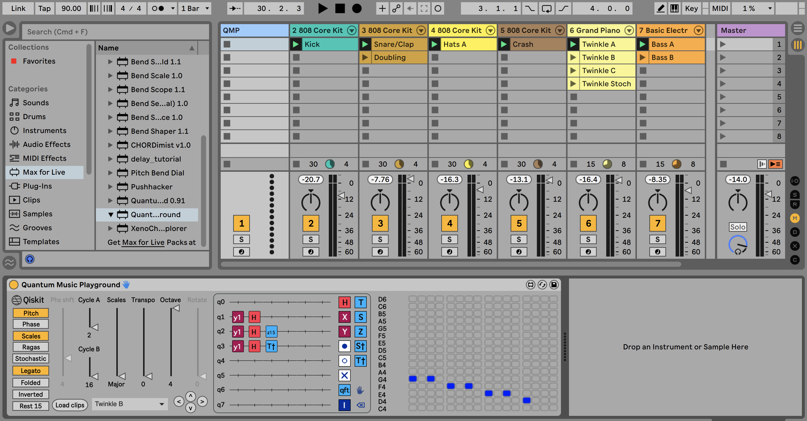

Taking a closer look at Quantum Music Playground in the following image, you'll notice a column of gates on the left side of the quantum circuit that are labeled **y1**. 

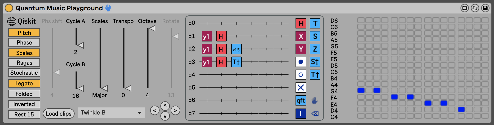

These are examples of the more general [RY gate](https://quantum-computing.ibm.com/composer/docs/operations-glossary/operations-glossary#ry-gate), which is defined by its amount of rotation on the Y axis of a [Bloch sphere](https://javafxpert.github.io/grok-bloch/). With the exception of the **Y** gate itself, the RY gates are expressed in Quantum Music Playground with a lower case **y** and the number of π/8 radians by which they rotate the on the Y axis. Here is a table of RY gates and their rotations expressed in π/8 radians.

| RY gate:         | y0   | y1   | y2   | y3   | y4   | y5   | y6   | y7   | Y    | y9   | y10  | y11  | y12  | y13  | y14  | y15  |
| ---------------- | ---- | ---- | ---- | ---- | ---- | ---- | ---- | ---- | ---- | ---- | ---- | ---- | ---- | ---- | ---- | ---- |
| **π/8 radians**: | 0    | 1    | 2    | 3    | 4    | 5    | 6    | 7    | 8    | 9    | 10   | 11   | 12   | 13   | 14   | 15   |

An effect of rotating a wire with an RY gate is that its probability amplitude can increase or decrease. We leverage this effect in Quantum Music Playground by setting a probability amplitude threshold, below which a given basis state's note won't be played. By applying certain RY gates on one or more wires, corresponding notes may be directed not to play. In the the **Twinkle B** example, we're applying slight Y rotations on wires **q1** - **q3**, which has the effect of dropping out the notes on the basis states that begin with `111`. This is illustrated in the following image.

In general, the following technique may be used to express basis states to drop out, putting the RY gates to the left of the H gates.

- To drop out all basis states that have `1` in *one* given position, use a **y3** gate.
- To drop out all basis states that have `0` in *one* given position, use a **y13** gate.  
- To drop out all basis states that have some combination of `1` and `0` bits in *two* given positions, use **y2** and **y14** gates, respectively.
- To drop out all basis states that have some combination of `1` and `0` bits in *three* or *four* given positions, use **y1** and **y15** gates, respectively.

#### Dropping out a note by putting it in pitch 15

Another way to drop out a note is to select the **Rest 15** toggle button, and use some method (usually a phase gate) to make the desired note appear on the top row of the sequence grid. This technique is demonstrated in the following image, where the top row of the sequence grid is now labeled **REST**.

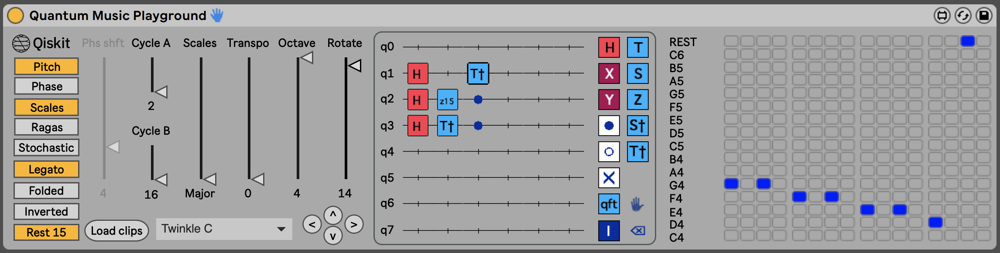

This example leverages multiple control gate modifiers. In this case, the **T†** gate will only be rotated for basis states who bits corresponding to **q2** and **q3** are both `1` . We'll explore control gate modifiers in more detail next.

## Understanding control gate modifiers

We've used control gate modifiers with various gates in several of the examples, so let's gain a deeper understanding about them. In the following image of the **Bass A** clip in Quantum Music Playground, you can see their use in some of the ways discussed previously. In addition, notice that in the third column of wire **q4** the control gate modifier is an empty circle. This is an *anti-control* gate modifier, and its behavior is the opposite of its filled-circle counterparts. Specifically, the corresponding bit must be `0` for the gate it is modifying to operate. Therefore, the **z13** phase gate in the third column will only operate on sequence steps whose basis states contain `0` and `1` in bit positions corresponding to **q4** and **q3**, respectively.

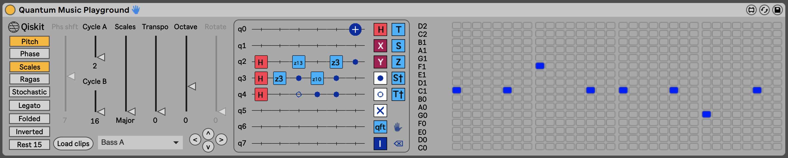

The following table shows which gates in Quantum Music Playground may have control (and anti-control) gate modifiers, as well as how many modifiers may be used with the gate.

| Gate                                                         | Max control modifiers |
| ------------------------------------------------------------ | --------------------- |
| **H gate**                                                   | 2                     |
| **X gates:** **x0** - **x7**, **X**, **x9** - **x15**        | 5                     |
| **Y gates:** **y0** - **y7**, **Y**, **y9** - **y15**        | 5                     |
| **Phase gates:** **z0**, **z1**, **T**, **z3**, **S**, **z5** - **z7**, **Z**, **z9** - **z11**, **S†**, **z13**, **T†**, **z15** | 5                     |

Now that we've discussed how to express melodic and rhythmic sequences with quantum circuits, let's explore additional musical functionality available in Quantum Music Playground.

## Exploring additional musical functionality

Up to this point we've focused on creating quantum circuits to select instruments and pitches, and to express rhythm patterns. When composing a song, of course, there are countless choices involving things such as instrument banks, octaves, musical scales, and time signatures. These choices help implement abstract musical sequences expressed by your quantum circuits. They are located in the left side of the Quantum Music Playground device, shown in the following image.

### Selecting musical octaves

In Ableton Live, a track may contain either a bank of instruments (e.g. a drum kit), or an instrument that plays pitches. In the former case, a MIDI note selects an instrument, and in the latter case a MIDI note selects a note pitch. In the following screenshot from the previous example of the **Hats A** clip, the vertical slider labeled **Octave** has **Kit** selected.

The instrument names displayed in the column to the left of the musical sequence grid are from the drum kit placed on the same track as the **Hats A** clip resides. The MIDI note values generated when **Kit** is selected range from 36 through 51, which often correspond to the main instruments in an instrument bank.

By contrast, in the following screenshot from the previous example of the **Bass B** clip, the vertical slider labeled **Octave** has **0** selected.

Available octave numbers selections are **-1**, **0**, **1**, **2**, **3** and **4**. Selecting an octave number normally causes the lowest pitch in the musical sequence grid to be the note C in the corresponding octave. For example, in the **Bass B** clip, selecting **Octave 0** causes the lowest pitch in the musical sequence grid to be **C0**.

### Changing musical scales

TODO: Verify that musical modes were implement correctly in QMP.

By default, the musical scale known as the **Major** scale is selected in the **Scales** slider. 

### Transposing musical pitches

### Implementing time signatures

### Playing notes legato

### Folding a musical scale

### Inverting a musical scale 

### Generating stochastic pitches

## Miscellaneous functionality

### Loading MIDI clips

#### QMP metadata in MIDI clips

### Selecting a MIDI clip

### Moving gates on the quantum circuit

## Indian classical music related functionality

### Selecting Carnatic ragas

### Controlling lengths of timecycles

TODO: Left off here

============= FODDER BELOW =================

Examining the following musical representation of the same statevector reveals that the phase of a basis state is represented by the row in which a cell is filled. 

In the center of the device is a [quantum circuit](https://qiskit.org/documentation/qc_intro.html#quantum-circuits) whose resultant [statevector](https://qiskit.org/textbook/ch-states/representing-qubit-states.html#statevectors) is represented musically in the grid to the right of the circuit. For comparison, if you entered this circuit in the [IBM Quantum Composer](https://quantum-computing.ibm.com/) the circuit and resultant statevector would appear similar to the following image.

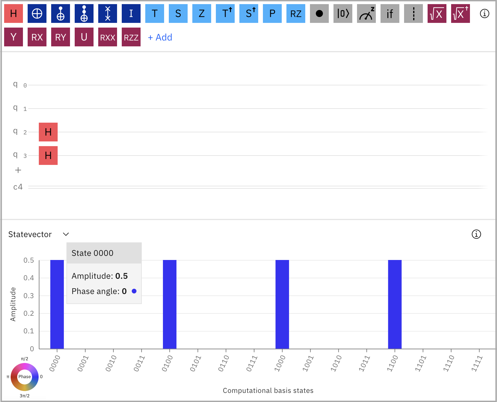

The bar graph shows that four of the basis states in the statevector have non-zero amplitudes, and that they all have a phase angle of 0 (as noted by the popup as well as the **Phase** color legend). As you interact with the Quantum Music Composer device, the MIDI information in the selected Ableton Live clip is updated with a sequence of notes as shown in the following image.

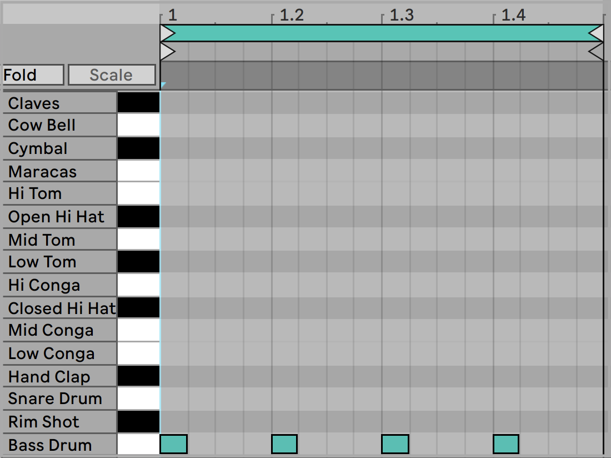

This one-measure sequence is looped, playing the kick (bass) drum once for each of the four beats in the measure. 

 