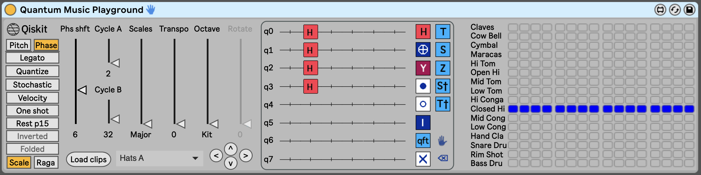

# Quantum Music Playground 0.95 Tutorial
## Summary

Playground for composing music using quantum states. Implemented as a Max for Live device in Ableton Live 11, and includes a MicroQiskit quantum simulator. Free, open source, Apache 2.0 licensed. Developed by James L. Weaver, [@JavaFXpert on Twitter](https://twitter.com/JavaFXpert). 

Here is a [Quantum Music Playground presentation video](https://youtu.be/E3CMhdUY1hE) given at IBM Quantum Educators Summit on 4-Aug-2021.

Here is a short [video of expressing a portion of Canon in D](https://youtu.be/Vpp364Sgivk) with Quantum Music Playground.

> Please note that it is ***not*** necessary to have prior knowledge of quantum computing in order to use Quantum Music Playground. We'll sneak in what you need to know as we go along, and will reference helpful (but not essential to internalize) resources.
>
> It is necessary to have a version of Ableton Live that supports Max for Live devices, which is [available as a 90 day free trial](https://www.ableton.com/en/trial/) at the time of this writing. Ableton Live 11 Suite will work, and so will Ableton Live 11 Standard plus Max for Live.

## Introduction

The Quantum Music Playground is a tool for composing music, as well as an enjoyable way of gaining intuition about quantum circuits and states. It is implemented as a Max for Live device in the Ableton Live 11 digital audio workstation (DAW), and includes a MicroQiskit quantum simulator. The following screenshot shows an Ableton Live Session View that contains [MIDI](https://en.wikipedia.org/wiki/MIDI) clips that play an arrangement of the well known song entitled *Twinkle Twinkle Little Star*. Please perform these two steps so that you can play the musical examples and participate in the tutorial activities:

1. The Ableton Live set from which many of the examples in this tutorial were taken may be [downloaded](https://github.com/JavaFXpert/quantum-music-playground/raw/master/sets/twinkle2.als) from the sets folder of the Quantum Music Playground repository. Please open this set in Ableton Live 11. 
2. It is necessary to [download the Quantum Music Playground v0.95 device](https://github.com/JavaFXpert/quantum-music-playground/raw/master/releases/Quantum%20Music%20Playground%20v0.95.amxd) from the releases folder of the Quantum Music Playground repository and drag it into its own empty MIDI track (by convention in the leftmost track, naming it **QMP**).

Here is a [video that shows performing these steps on a Mac](https://youtu.be/8tqGcLVzMZU), but the process on Windows is very similar.

Here is a [video of Twinkle Twinkle Little Star](https://youtu.be/5D2mmwkyJVM) paying in Ableton Live, using Piano, Bass and various percussion instruments, whose clips are expressed using quantum circuits.

At the bottom of the screenshot is the Quantum Music Playground device, shown here expressing the kick drum part contained in the **Kick** clip in one of the tracks labeled **808 Core Kit**. In the center of the device is a [quantum circuit](https://qiskit.org/documentation/qc_intro.html#quantum-circuits), shown by itself in the following image.

On the right side of the quantum circuit is a toolbox with quantum operations that may be placed on the quantum circuit, which is on the left side of the image. For the kick drum part, we're using a couple of **H** gates on the wires labeled **q2** and **q3**. The result is that the **Bass Drum** will play a [four on the floor](https://en.wikipedia.org/wiki/Four_on_the_floor_(music)) drum pattern shown in the sequence grid below. This sequence grid represents one measure in [4/4 time](https://en.wikipedia.org/wiki/Time_signature#Characteristics), and each column represents a [sixteenth note](https://en.wikipedia.org/wiki/Sixteenth_note). As you can see, the bass drum is playing on each of the four beats in the measure.

The logic by which a couple of **H** gates (also known as *Hadamard* gates) resulted in this drum pattern can be explained using some basic math:

First off, the wires labeled **q0** - **q7** on the quantum circuit represent the least significant digit through the most significant digit of a binary value. The reason that there are 16 columns in the previous grid is that **q3** (the fourth wire) is the highest wire on which a gate is present. This defines a range of 24 binary numbers from `0000` - `1111`, and are labeled **Basis states** across the bottom of the previous image. Each *basis state* represents a step in our musical sequence. 

> **A bit about basis states**
>
> A basis state, sometime referred to as a *computational basis state*, is a concept used in quantum computing to represent a component of a quantum state. In this example, the quantum circuit defines a quantum state that is comprised of 16 basis states. Each basis state contains a complex number from which two important values may be derived: 
>
> - The *probability amplitude* that represents the likelihood that this basis state will be the result when measuring the quantum state, and 
> - the *phase angle* of this basis state. 
>
> Both of these concepts will be revisited at appropriate times in this tutorial. For now, it is important to understand that there is one binary digit in each basis state for each wire in a quantum circuit, where the number of wires is determined by the highest wire on which a gate is present. It is also necessary to know that the rightmost binary digit of each basis state corresponds to the topmost wire, labeled **q0**. As you may know, the rightmost binary digit is referred to as being in position 0, because its place value is 20 in the binary numbering system.

To calculate on which of these sequence steps the bass drum will play, take a look at the quantum circuit and the sequence grid together in this image while reading the explanation that follows.

Each of the wires in the quantum circuit contains an initial value of 0.

- Because there are no gates on wire **q0**, the drum may only play on basis states whose 0 (least significant) position contains 0.
- Because there are no gates on wire **q1**, the drum may only play on basis states whose 1 position contains 0.
- Because there is an **H** gate on wire **q2**, the drum may play on basis states whose 2 position contains either 0 or 1. This is because the **H** gate puts the wire into a combination of 0 and 1.
- Because there is an **H** gate on wire **q3**, the drum may play on basis states whose 3 position contains either 0 or 1.

Putting that all together, the bass drum will play on all of the basis states whose 0 and 1 positions contain 0, which are `0000`, `0100`, `1000` and `1100`. 

> **Try it out:**
>
> Experiment with simple bass drum beat patterns by removing and placing **H** gates on the quantum circuit. To remove a gate, press the ⌫ tool (bottom right of toolboxl) and press a gate to delete. To add an **H** gate, press the **H** gate (upper left in toolbox) and press a location on the quantum circuit. 
>
> Here is a [video of such an experimentation session](https://youtu.be/inJbKNVu3vQ). Notice that the user clicked the track's **S**olo button and adjusted its mixer volume so that the bass drum could be heard clearly while experimenting. 

You may be wondering why the bass drum, and not the other percussion instruments, are played as a result of this quantum circuit. The short answer is that the Quantum Music Playground chooses instruments and pitches based upon the phase angles mentioned earlier. The next section contains a more complete and satisfying explanation.

## Choosing instruments and pitches

Up to this point we've created a simple bass drum beat pattern by placing Hadamard gates on a quantum circuit. Now we're going to choose a different instrument to provide a cymbal crash at the beginning of each measure. As before, at the bottom of the following screenshot is the Quantum Music Playground device, now expressing the cymbal part contained in the **Crash** clip in another one of the tracks labeled **808 Core Kit**. You may navigate to the that clip by selecting **Crash** from the dropdown list to the right of the **Load clips** button in the Quantum Music Playground device.

Let's examine the Quantum Music Playground device by itself in the following image.

The quantum circuit in this **Crash** clip contains just one gate, namely the **I** (also known as Identity) gate. The **I** gate doesn't alter the state of a wire, but it's used here to set the number of basis states, and therefore steps, to 16 for this clip. The length of this **Crash** clip is now the same length as the **Kick** clip, so as each clip is playing in a loop, the cymbal and the bass drum will play together on the downbeat of the measure, followed by the bass drum playing on the remaining three beats. 

To see why the **Cymbal**, rather than the **Bass Drum**, will be played, take a look at the disabled **Phs shft** slider and notice the value of 13 at the bottom. This indicates that the global phase angle shift, often referred to as *global phase shift*, of the quantum state is 13π/8 radians (292.5 degrees). This happens to correspond with the value of 13 to the right of the **Cymbal** row in the following image.

As mentioned previously, each individual basis state contains a phase angle. Shifting the global phase by π/8 radians (22.5 degrees) shifts each individual phase by π/8 radians, which results in moving the notes up one instrument or pitch.

> **Try it out:**
>
> Experiment with shifting the global phase angle by selecting the **Phase** button, moving the **Phs shft** slider up or down, and then selecting the **Pitch** button to keep the global phase from automatically shifting.
>
> Here is a [video of such an experimentation session](https://youtu.be/pGVkbw5xuS0). I guess the song needed more cowbell!

### Shifting the phase angles of basis states

To create an interesting beat pattern or melody, it is usually necessary to shift the phase angles of various basis states. A common way to accomplish this is to follow an **H** gate with a *phase* gate. To demonstrate this, we'll play hi-hat cymbals, shifting back and forth from open to closed hi-hats. The bottom of the following screenshot shows the Quantum Music Playground device, now expressing the hi-hat part contained in the **Hats A** clip in yet another one of the tracks labeled **808 Core Kit**.  

Now we'll examine the Quantum Music Playground device by itself in the following image. The quantum circuit in this **Hats A** clip contains a column of four **H** gates on wires **q0** - **q3**, which defines one measure with a beat pattern full of sixteenth notes. The circuit also contains two of the *phase gates* obtained from right column of the toolbox, and a *control gate modifier* taken from the toolbox's left column. 

We'll discuss phase gates and control gate modifiers shortly, but let's analyze the results of progressively adding gates to this circuit. The following image shows the Quantum Music Playground device after placing only the **H** gates. 

As with the **Kick** clip earlier, the **H** gates play a beat pattern on the **Bass Drum**. Next, the following image shows the **Phase** button selected and the **Phs shft** slider adjusted so that the **Closed Hi-hat** is played with the same beat pattern, having been shifted by a global phase. 

To play the **Open Hi-hat** on the third sixteenth note of every beat, we employ one of the *phase gates*, specifically the **S** gate. 

The **S** gate rotates the phase on a wire by 4π/8 radians, which rotates the phase on each of the basis states whose corresponding position contains a 1. This is seen more clearly in the following image, in which the rotation is performed on every basis state whose bit in position 1 is 1

Finally, to play the **Open Hi-hat** on the fourth sixteenth note of every beat, we employ another one of the *phase gates*, specifically the **S†** gate, in conjunction with the control gate modifier. 

The **S†** gate rotates the phase on a wire by 12π/8 radians. However, when a control gate modifier is placed in the same column, the **S†** gate only operates when the control wire has a value of 1. This rotates the phase on each of the basis states whose positions corresponding to the **S†** gate and the control gate modifier both contain a 1. This is seen more clearly in the following image, in which the rotation is performed on every basis state whose bits in positions 0 and 1 are both 1.

> **Try it out:**
>
> Create different beat patterns that consist of closed and open hi-hats by placing the phase gates and control gate modifiers on various wires. Here is a [video with such experimentation](https://youtu.be/5QKDtJ25Zrg).

## Playing with rhythm

So far, the rhythms we've created have consisted of instruments playing at consistent time intervals. For example, our **Kick** clip played the bass drum on the four beats of the measure, and the **Hats A** clip played the hi-hats on each sixteenth note. Now we'll discuss how to create syncopated rhythms, beginning with playing on the [off-beats](https://en.wikipedia.org/wiki/Beat_(music)#On-beat_and_off-beat) . To demonstrate this, we'll play a snare drum on beat two of a measure, and a hand clap on beat four of the measure, but neither will be played on beats one and three. The bottom of the following screenshot shows the Quantum Music Playground device, now expressing the **Snare Drum** and **Hand Clap** parts contained in the **Snare/Clap** clip in another one of the tracks labeled **808 Core Kit**.

Looking at the following image of the Quantum Music Playground, we see that there are some similarities to the previous example in which open and closed hi-hats were played, but there are some differences to point out as well. 

One difference is that the [Phase gate](https://quantum-computing.ibm.com/composer/docs/operations-glossary/operations-glossary#phase-gate) on the quantum circuit is labeled **z1**, but there is no **z1** gate in the toolbox. This is because out of the 16 possible phase gates that rotate multiples of π/8 radians, only five of them (**T**, **S**, **Z**, **S†** and **T†**) have names. The rest are expressed in Quantum Music Playground with a lower case **z** and the number of π/8 radians by which they rotate the phase. Here is a table of phase gates and their rotations expressed in π/8 radians.

| Phase gate:      | z0   | z1   | T    | z3   | S    | z5   | z6   | z7   | Z    | z9   | z10  | z11  | S†   | z13  | T†   | z15  |
| ---------------- | ---- | ---- | ---- | ---- | ---- | ---- | ---- | ---- | ---- | ---- | ---- | ---- | ---- | ---- | ---- | ---- |
| **π/8 radians**: | 0    | 1    | 2    | 3    | 4    | 5    | 6    | 7    | 8    | 9    | 10   | 11   | 12   | 13   | 14   | 15   |

When a gate is placed, or selected on the quantum circuit with the ✋ tool (near the bottom right in the toolbox), it may be rotated by adjusting the **Rotate** slider, or clicking and dragging the gate vertically.

Another difference from the previous example is that an **X** gate, also known as a *NOT* gate or a *bit-flip* gate, is leveraged on wire **q2** to make the instruments play on the off beats. This is seen more clearly in the following image, in which the notes appear on some basis states whose bit in positions 2 is 1, because the **X** gate flipped that wire to having a value of 1.

**Try it out:**

Create different beat patterns that consist of **Snare Drum** and **Hand Claps** by placing and removing X gates, and H gates, on empty wires. Here is a [video with such experimentation](https://youtu.be/hLGfqiLndGE).

Now that we've used the **X** gate to play on the off beat, let's use it to syncopate a simple bass line.

### Leveraging the CNOT gate for more syncopation

Let's discuss how to create more syncopated rhythms, leveraging the [CNOT gate](https://quantum-computing.ibm.com/composer/docs/operations-glossary/operations-glossary#cnot-gate) . This gate is also known as the *controlled-NOT* gate, as well as the *controlled-X gate*. To demonstrate this technique, we'll play a simple bass line in a syncopated fashion. The bottom of the following screenshot shows the Quantum Music Playground device, now expressing the note pitches to be played by the bass guitar in the **Bass B** clip of the track labeled **Basic Electr**.

Looking at the following image of the Quantum Music Playground, you'll notice that we're playing note pitches rather than percussion instruments. The main point of this example, however, is the use of the control gate modifier with the **X** gate, turning it into a *CNOT* gate. Notice that the bit is flipped only when the control wire has a value of 1. This flips the bit in the position on which the **X** gate is placed, but only on the basis states whose position corresponding to the control gate modifier contain a 1.

This is seen more clearly in the following image, in which the notes appear on some basis states whose bit in position 0 is 1, because the **X** gate conditionally flipped that wire to having a value of 1.

**Try it out:**

Create different beat patterns by placing and removing **X** gates on empty wires, placing a control gate modifier in the same column to the right of an **H** gate. Also, add **H** and phase gates to empty wires, rotating the latter until melodically pleasing. Here is a [video with such experimentation](https://youtu.be/U78tB4lgPsk).

Now that we've discussed how to syncopate rhythms with **X** and CNOT gates, we'll introduce another way to manipulate rhythms.

### Manipulating rhythms with controlled-H gates

We've leveraged **H** gates quite a bit to create rhythm patterns so far. Now we'll add control gate modifiers to **H** gates for more rhythmic control. In the following image of the **Doubling** clip in Quantum Music Playground, notice the use of control gate modifiers with some of the **H** gates to implement a well-known drum pattern in electronic dance music. This doubling pattern is achieved in part by making the **H** gate on wire **q0** conditional on whether the final eight out of 32 steps in the pattern are being played. Note that we're using two control gate modifiers in that column, in this case making the **H** gate active only on those of the 32 basis states (numbered `00000` through `11111`) that begin with `11`.

Notice that the **One shot** button is selected, which causes the clip to play just once, rather than looped. Now that we've discussed multiple ways of creating patterns, we'll introduce ways to drop notes out of a pattern so that they don't play.

### Dropping notes out of a pattern

Creating a rhythm is as much about the notes that are *not* played as the notes that are played. Therefore, an important part of rhythm is inserting rests. There are several techniques for doing so with Quantum Music Playground, with the first method being turning down the *probability amplitude* of their basis states. To demonstrate this, we'll play the "up above the world so high, like a diamond in the sky" phrase of the melody in *Twinkle Twinkle Little Star*. The bottom of the following screenshot shows the Quantum Music Playground device, now expressing the note pitches to be played by the piano in the **Twinkle B** clip of the track labeled **Grand Piano**.

Taking a closer look at Quantum Music Playground in the following image, you'll notice a column of gates on the left side of the quantum circuit that are labeled **y1**. 

These are examples of the more general [RY gate](https://quantum-computing.ibm.com/composer/docs/operations-glossary/operations-glossary#ry-gate), which is defined by its amount of rotation on the Y axis of a [Bloch sphere](https://javafxpert.github.io/grok-bloch/). With the exception of the **Y** gate itself, the RY gates are expressed in Quantum Music Playground with a lower case **y** and the number of π/8 radians by which they rotate the on the Y axis. Here is a table of RY gates and their rotations expressed in π/8 radians.

| RY gate:         | y0   | y1   | y2   | y3   | y4   | y5   | y6   | y7   | Y    | y9   | y10  | y11  | y12  | y13  | y14  | y15  |
| ---------------- | ---- | ---- | ---- | ---- | ---- | ---- | ---- | ---- | ---- | ---- | ---- | ---- | ---- | ---- | ---- | ---- |
| **π/8 radians**: | 0    | 1    | 2    | 3    | 4    | 5    | 6    | 7    | 8    | 9    | 10   | 11   | 12   | 13   | 14   | 15   |

An effect of rotating a wire with an RY gate is that its probability amplitude may increase or decrease. We leverage this effect in Quantum Music Playground by making the MIDI velocity proportional to the probability amplitude. Consequently, the volumes of the notes vary according to their probability amplitudes. 

> Note that this default behavior may be turned off by de-selecting the **Velocity** toggle button, which causes all notes to be played at the same velocity.

Additionally, there is a probability amplitude threshold below which a given basis state's note won't be played. By applying certain RY gates on one or more wires, corresponding notes may be directed not to play. In the **Twinkle B** example, we're applying slight Y rotations on wires **q1** - **q3**, which has the effect of dropping out the notes on the basis states that begin with `111`. This is illustrated in the following image.

In general, the following technique may be used to express basis states to drop out, putting the RY gates to the left of the H gates.

- To drop out all basis states that have `1` in *one* given position, use a **y3** gate.
- To drop out all basis states that have `0` in *one* given position, use a **y13** gate.  
- To drop out all basis states that have some combination of `1` and `0` bits in *two* given positions, use **y2** and **y14** gates, respectively.
- To drop out all basis states that have some combination of `1` and `0` bits in *three* or *four* given positions, use **y1** and **y15** gates, respectively.

#### Dropping out a note by putting it in pitch 15

Another way to drop out a note is to select the **Rest 15** toggle button, and use some method (usually a phase gate) to make the desired note appear on the top row of the sequence grid. This technique is demonstrated in the following image, where the top row of the sequence grid is now labeled **REST**.

This example leverages multiple control gate modifiers. In this case, the **T†** gate will only be rotated for basis states whose bits corresponding to **q2** and **q3** are both `1` . We'll explore control gate modifiers in more detail next.

## Understanding control gate modifiers

We've used control gate modifiers with various gates in several of the examples, so let's gain a deeper understanding about them. In the following image of the **Bass A** clip in Quantum Music Playground, you can see their use in some of the ways discussed previously. In addition, notice that in the third column of wire **q4** the control gate modifier is an empty circle. This is an *anti-control* gate modifier, and its behavior is the opposite of its filled-circle counterparts. Specifically, the corresponding bit must be `0` for the gate it is modifying to operate. Therefore, the **z13** phase gate in the third column will only operate on sequence steps whose basis states contain `0` and `1` in bit positions corresponding to **q4** and **q3**, respectively.

The following table shows which gates in Quantum Music Playground may have control (and anti-control) gate modifiers, as well as how many modifiers may be used with the gate.

| Gate                                                         | Max control modifiers |
| ------------------------------------------------------------ | --------------------- |
| **H gate**                                                   | 2                     |
| **X gates:** **x0** - **x7**, **X**, **x9** - **x15**        | 2                     |
| **Y gates:** **y0** - **y7**, **Y**, **y9** - **y15**        | 2                     |
| **Phase gates:** **z0**, **z1**, **T**, **z3**, **S**, **z5** - **z7**, **Z**, **z9** - **z11**, **S†**, **z13**, **T†**, **z15** | 5                     |

Please note that if a column on a quantum circuit contains more than one of these gates, each will share the same control gate modifiers in the column. For example if a column contains one **X** gate, one **H** gate, and one control gate modifier, the **X** gate will become a CNOT gate, and the **H** gate will be become a controlled-H gate. Now that we've discussed how to express melodic and rhythmic sequences with quantum circuits, let's explore additional musical functionality available in Quantum Music Playground.

## Exploring additional musical functionality

Up to this point we've focused on creating quantum circuits to select instruments and pitches, and to express rhythm patterns. When composing a song, of course, there are countless choices involving things such as instrument banks, octaves, musical scales, and time signatures. These choices help implement abstract musical sequences expressed by your quantum circuits. They are located in the left side of the Quantum Music Playground device, shown in the following image.

### Selecting musical octaves

In Ableton Live, a track may contain either a rack of instruments (e.g. a drum kit), or an instrument that plays pitches. In the former case, a MIDI note selects an instrument, and in the latter case a MIDI note selects a note pitch. In the following screenshot from the previous example of the **Hats A** clip, the vertical slider labeled **Octave** has **Kit** selected.

The instrument names displayed in the column to the left of the musical sequence grid are from the drum kit placed on the same track as the **Hats A** clip resides. The MIDI note values generated when **Kit** is selected range from 36 through 51, which often correspond to the main instruments in an instrument rack.

By contrast, in the following screenshot from the previous example of the **Bass B** clip, the vertical slider labeled **Octave** has **0** selected.

Available octave number selections are **-1**, **0**, **1**, **2**, **3** and **4**. Selecting an octave number normally causes the lowest pitch in the musical sequence grid to be the note C in the corresponding octave. For example, in the **Bass B** clip, selecting **Octave 0** causes the lowest pitch in the musical sequence grid to be **C0**.

### Changing musical scales

By default, the musical scale known as **Major** is selected in the **Scales** slider. Several other scales and modes (e.g. NatMinor and Dorian) are available by selecting them in the slider. As shown in the following image, when the scale or mode is changed the musical pitches in the column to the left of the musical sequence grid change appropriately.

### Transposing musical pitches

By default, the lowest note in the musical sequence grid is C, playing in the key of C. To play in another musical key, select the number of semitones to transpose in the **Transpo** slider. As shown in the following image, when the key is transposed the musical pitches in the column to the left of the musical sequence grid change accordingly.

### Folding a musical scale

When using a diatonic scale it is sometimes convenient for the pitches to range from a tonic to the tonic an octave above, for a total range of eight pitches. To achieve that result, the **Folded** toggle button may be selected. As shown in the following image, the pitches in the column to the left of the musical sequence grid change accordingly.

### Inverting a musical scale 

The pitches the musical sequence grid my be inverted by selecting the **Inverted** toggle button. As shown in the following image, the pitches in the column to the left of the musical sequence grid change accordingly.

### Playing notes legato

Notes play for a duration of one quarter note by default. To make notes play with a legato technique (held until the following note begins), select the **Legato** toggle button.

### Playing harmonic intervals and chords

By default, notes are played melodically (one after another). Notes may be played harmonically by selecting the **Quantize** toggle button, producing intervals or chords. In the following example, a jazzy chord progression is played harmonically, as their individual notes are quantized into chords.

In this example the quantization occurs among basis states whose bit in position 3 are the same. Consequently, the following groups of notes are played harmonically:

- the C major seventh chord in basis states `00000` - `00111` 
- the D minor seventh chord in basis states `01000` - `01111`
- the E minor seventh chord in basis states `10000` - `10111`
- the F major seventh chord in basis states `11000` - `11111`

Similarly, the following example  demonstrates playing intervals harmonically.

In this example the quantization occurs among basis states whose bit in position 2 are the same. Consequently, the following pairs of notes are played harmonically:

- the **E1** - **C2** interval in basis states `00000` - `00011`
- the **F1** - **D2** interval in basis states `00100` - `00111`
- the **G1** - **E2** interval in basis states `01000` - `01011`
- the **A1** - **F2** interval in basis states `01100` - `01111`
- the **B1** - **G2** interval in basis states `10000` - `10011`
- the **C2** - **A2** interval in basis states `10100` - `10111`
- the **D2** - **B2** interval in basis states `11000` - `11011`
- the **E2** - **C3** interval in basis states `11100` - `11111`

In each example, the bit position to use for quantization is ascertained by adding 2 to the position of the lowest occupied wire. In the first example, the lowest occupied wire is 1, so quantization occurs among basis states whose bit in position 3 is the same. In the second example, the lowest occupied wire is 0, so quantization occurs among basis states whose bit in position 2 is the same.

Here is a [video of expressing Canon in D](https://youtu.be/Vpp364Sgivk) that demonstrates how to quantize notes into chords. 

### Implementing time cycles

Some of the most common time signatures and loop lengths in music are some power of 2. When other time cycles are desired (e.g. playing in 5/4 time signature, or in some Indian classical time cycles), a different length may be selected. For example, the following image shows part of the *Twinkle Twinkle Little Star* melody in clip **Twinkle A** being played in 7/8 time. 

This is achieved by selecting 14 in the **Cycle A** slider, which removes all musical steps after the 14th up to the end of the next power of 2. This is visually represented by a column of blue cells wherever a step is removed. The **Cycle B** slider may be used in conjunction with **Cycle A** when two cycles are nested, as is required by some complex time cycles in Indian classical music.

### Generating stochastic pitches

All of the Quantum Music Playground functionality covered so far has been deterministic, which leverages that fact that we have access to the probability amplitudes and phases of the basis states in a quantum state. We only have access to this information because Quantum Music Playground uses a quantum simulator. Using a real quantum computer, information about an underlying quantum state is more opaque, and may only be glimpsed at via repeated measurements. To introduce some quantum measurement randomness, select the **Stochastic** toggle button as shown in the following image of the **Twinkle Stoch** clip.

As a visual indication that pitches have been generated via measurement, notes in the musical sequence grid are bright green. The musical sequence contains the same number of notes and temporal spacing as before. However, the generated pitches result from taking one measurement of the quantum circuit for each of the notes, and using the pitch that corresponds to the basis state resulting from each measurement. 

When a clip has the **Stochastic** toggle selected, new pitches will be generated each time the clip is loaded. If the user modifies the quantum circuit or any other setting, the clip will toggle out of **Stochastic** mode.

## Indian classical music related functionality

Quantum Music Playground contains some limited functionality that supports composing Indian classical music. This functionality includes the ability to select ragas instead of western scales, and to control the lengths of complex time cycles.

### Selecting ragas

The following image of Quantum Music Playground shows the first of the fundamental sequences (Sarali Varisai 1), used to teach Carnatic music. It is played in the Mayamalavagowla raga, which is number 15 in the [Melakarta ragas](https://en.wikipedia.org/wiki/Melakarta#Table_of_Melakarta_ragas). To select this raga, first press the **Raga** button, after which the **Scales** slider becomes a **Ragas** slider. Then select **Raga15** from the **Ragas** slider.

Here is a [video of Sarali Varisai 1](https://youtu.be/q5gl7wVJjks) playing in Ableton Live, using Veena, Mridangam and Tabla (instruments) whose clips are expressed using quantum circuits. 

### Controlling lengths of time cycles

As discussed previously, Quantum Music Playground supports nested time cycles, such as required by the multi-cycle sequences in Carnatic lessons known as Alankaras. In the following example, the **Cycle B** slider is used in conjunction with **Cycle A** to implement the time cycles for Alankara 3.

Here is a [video of Alankara 3](https://youtu.be/abA6kk_AmIM) paying in Ableton Live, using Veena, Mridangam and Tabla (instruments) whose clips are expressed using quantum circuits.

 

## Miscellaneous functionality

Quantum Music Playground contain functionality not directly related to music composition, such as loading and selecting MIDI clips, and moving all gates on the quantum circuit.

### Loading MIDI clips

When the Quantum Music Playground device starts, it identifies all of the clips contained in all of the MIDI tracks of the current set. The dropdown list to the right of the **Load clips** button is populated with these clip names. When you add, rename, duplicate, move or delete a MIDI clip, pressing the **Load clips** button will update the dropdown list appropriately.

#### QMP metadata in MIDI clips

MIDI clips in Ableton Live store MIDI data that includes note pitches, start times, and durations. In addition to the playable notes in a clip, Quantum Music Playground stores metadata in the MIDI clip that expresses the quantum circuit, slider values, and button toggle states. This may be seen in the following image of the Ableton MIDI Clip View for the **Twinkle A** clip, whose measure numbers across the top will now be used as we discuss their contents.

For reference during this discussion, please also refer to the following image of the **Twinkle A** clip in Quantum Music Playground. In the previous image, measures 1 & 2 contain the MIDI notes for the notes to be played. Measures 3 - 5 contain a MIDI representation of the quantum circuit, beginning with the first column, with each note encoding either a blank cell or operation. Measure 6 contains slider values, with its final MIDI notes encoding the binary states of the toggle buttons. Please consult the [Quantum Music Playground source code](https://github.com/JavaFXpert/quantum-music-playground) for more details on this metadata representation. 

### Selecting a MIDI clip

To select a different MIDI clip in Quantum Music Playground, click the dropdown list located to the right of the **Load clips** button, and press the desired clip.

### Moving all operations on the quantum circuit

It is often desirable to move all of the operations in a quantum circuit to the left or right in order to make room for a column of operations. It is also desirable to move all of the operations in a quantum circuit up or down, as that halves or doubles the number of steps in the musical sequence, changing its speed relative to other clips. Provided the appropriate row or column is empty, the left, right, up and down buttons, labeled ''**<**'', ''**>**'', ''**^**'' and ''**v**'' respectively, may be used for those purposes.

## Questions / Issues?

Please reach out to [@JavaFXpert on Twitter](https://twitter.com/JavaFXpert), or open an issue in the [Quantum Music Playground repository](https://github.com/JavaFXpert/quantum-music-playground).

## 
